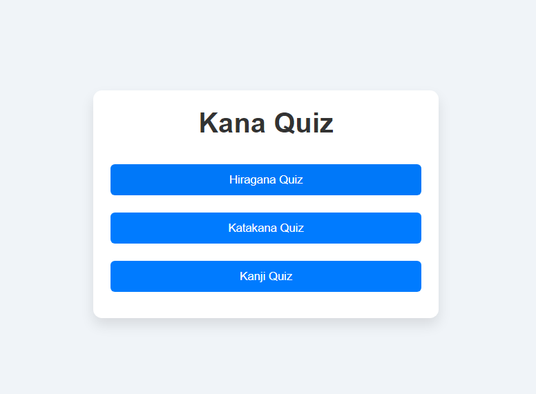
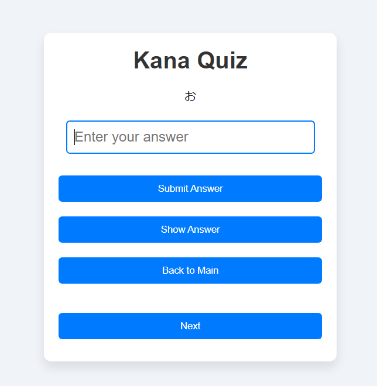
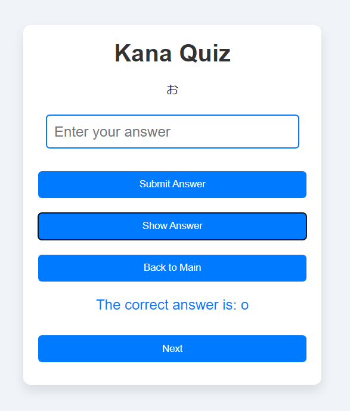

# JPD113QuizTest
> [Description](#description) | [Try](#try-on-browser) | [down source](#to-clone) | | [Screenshot Demo](#screenshot) | [Main Features include](#main-features-include)
## Description:
- Quiz Hiragana, Katakana, Kanji
## Try on browser:
- [here](https://meoleodeo.github.io/JPD113QuizTest/)
## To clone:
```bash
git clone https://github.com/Meoleodeo/Blue-Main-Character
cd .\Blue-Main-Character\SetUp\
echo finish
```
## Screenshot:




## Main Features include:
- text quiz random
- show answer
- update later
